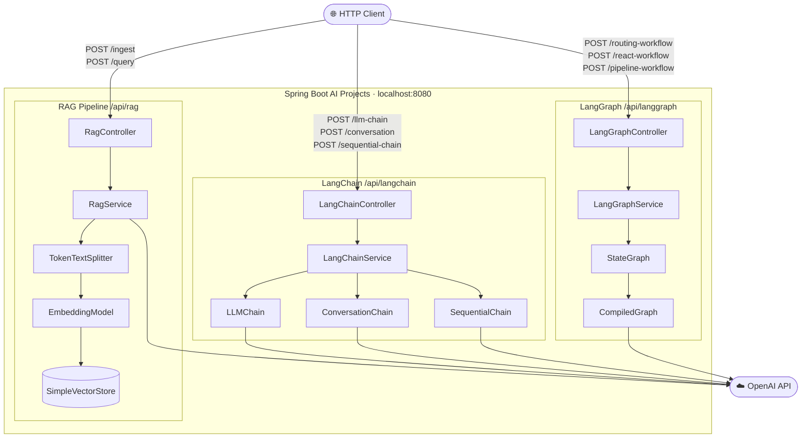
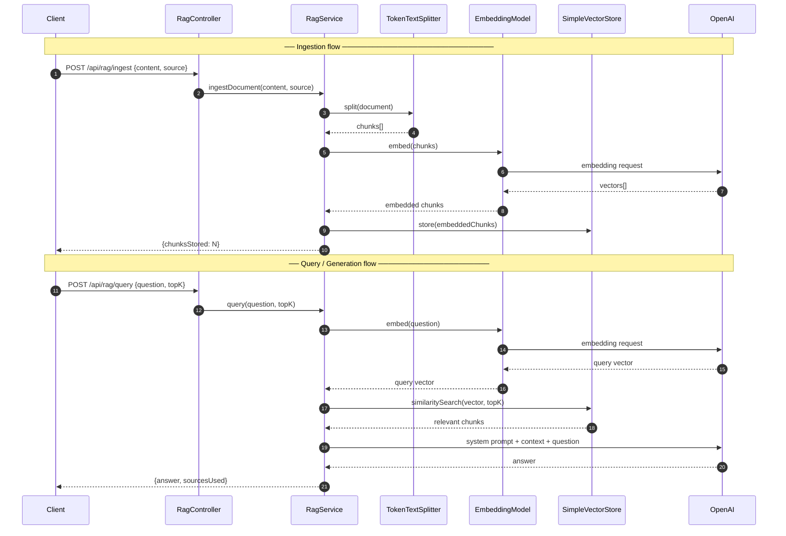
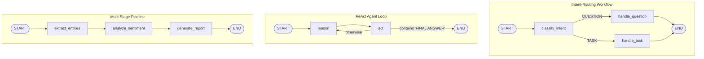

# Spring Boot AI Projects

A Spring Boot application demonstrating three key AI/LLM concepts using the [Spring AI](https://spring.io/projects/spring-ai) framework:

| Concept | Description |
|---------|-------------|
| **RAG Pipeline** | Retrieval-Augmented Generation: ingest documents → embed → retrieve → generate |
| **LangChain** | Prompt templates, LLM chains, conversation memory, sequential chains |
| **LangGraph** | Stateful workflow graphs with typed nodes, conditional edges, and agent loops |

---

## Table of Contents

- [Architecture](#architecture)
- [Prerequisites](#prerequisites)
- [Getting Started](#getting-started)
- [REST API Reference](#rest-api-reference)
  - [RAG Pipeline](#rag-pipeline-apirag)
  - [LangChain](#langchain-apilangchain)
  - [LangGraph](#langgraph-apilanggraph)
- [Project Structure](#project-structure)
- [Running Tests](#running-tests)
- [Concepts Explained](#concepts-explained)

---

## Architecture



---

## Prerequisites

| Tool | Version |
|------|---------|
| Java | 17+ |
| Maven | 3.9+ |
| OpenAI API Key | Required for runtime |

---

## Getting Started

### 1. Clone the repository

```bash
git clone https://github.com/goumze/spring_boot_based_ai_projects.git
cd spring_boot_based_ai_projects
```

### 2. Set your OpenAI API key

```bash
export SPRING_AI_OPENAI_API_KEY=sk-...
```

Or edit `src/main/resources/application.properties`:

```properties
spring.ai.openai.api-key=sk-...
```

### 3. Build and run

```bash
mvn spring-boot:run
```

The application starts on **http://localhost:8080**.

---

## REST API Reference

### RAG Pipeline `/api/rag`

#### Ingest a document

```http
POST /api/rag/ingest
Content-Type: application/json

{
  "content": "Spring AI is a framework for building AI-powered Java applications...",
  "source": "spring-ai-docs"
}
```

Response:

```json
{
  "message": "Document ingested successfully",
  "source": "spring-ai-docs",
  "chunksStored": 3
}
```

#### Query the knowledge base

```http
POST /api/rag/query
Content-Type: application/json

{
  "question": "What is Spring AI?",
  "topK": 4
}
```

Response:

```json
{
  "question": "What is Spring AI?",
  "answer": "Spring AI is a framework that simplifies building AI-powered applications in Java...",
  "sourcesUsed": ["spring-ai-docs"]
}
```

---

### LangChain `/api/langchain`

#### Run a single LLM chain

```http
POST /api/langchain/llm-chain
Content-Type: application/json

{
  "template": "Translate '{text}' to {language}.",
  "variables": { "text": "Hello world", "language": "French" }
}
```

#### Multi-turn conversation (with memory)

```http
POST /api/langchain/conversation/{sessionId}
Content-Type: application/json

{
  "systemPrompt": "You are a helpful travel advisor.",
  "message": "What should I pack for a trip to Japan in winter?"
}
```

Clear a session:

```http
DELETE /api/langchain/conversation/{sessionId}
```

#### Sequential chain (summarise → bullet points)

```http
POST /api/langchain/sequential-chain
Content-Type: application/json

{
  "text": "Long article or document text here..."
}
```

---

### LangGraph `/api/langgraph`

#### Intent routing workflow

Classifies input as `QUESTION` or `TASK` and routes to the appropriate handler node.

```http
POST /api/langgraph/routing-workflow
Content-Type: application/json

{ "input": "What is the capital of France?" }
```

#### ReAct (Reasoning + Acting) agent loop

Cycles between reasoning and acting until the agent emits `FINAL ANSWER:`.

```http
POST /api/langgraph/react-workflow
Content-Type: application/json

{ "input": "What are the main benefits of microservices architecture?" }
```

#### Multi-stage processing pipeline

Runs three sequential nodes: entity extraction → sentiment analysis → report generation.

```http
POST /api/langgraph/pipeline-workflow
Content-Type: application/json

{ "input": "Apple CEO Tim Cook announced new products in Cupertino today." }
```

All workflow responses include:

```json
{
  "workflowName": "intent-routing",
  "input": "What is the capital of France?",
  "output": "The capital of France is Paris.",
  "executionPath": ["classify_intent", "handle_question"],
  "finalState": { ... }
}
```

---

## Project Structure

```
src/
├── main/
│   ├── java/com/example/springai/
│   │   ├── SpringAiProjectsApplication.java
│   │   ├── config/
│   │   │   └── AiConfig.java                  # VectorStore bean
│   │   ├── rag/
│   │   │   ├── controller/RagController.java
│   │   │   ├── service/RagService.java
│   │   │   └── model/{DocumentRequest, QueryRequest, QueryResponse}.java
│   │   ├── langchain/
│   │   │   ├── controller/LangChainController.java
│   │   │   ├── service/LangChainService.java
│   │   │   ├── chain/{LLMChain, ConversationChain, SequentialChain}.java
│   │   │   └── model/{PromptTemplate, ChainResult}.java
│   │   └── langgraph/
│   │       ├── controller/LangGraphController.java
│   │       ├── service/LangGraphService.java
│   │       ├── graph/{GraphState, GraphNode, GraphEdge, StateGraph, CompiledGraph}.java
│   │       └── model/WorkflowResult.java
│   └── resources/
│       ├── application.properties
│       └── sample-docs/knowledge-base.txt
└── test/
    └── java/com/example/springai/
        ├── SpringAiProjectsApplicationTests.java
        ├── rag/RagServiceTest.java
        ├── langchain/LangChainServiceTest.java
        └── langgraph/LangGraphServiceTest.java
```

---

## Running Tests

```bash
mvn test
```

All tests use Mockito to mock `ChatClient` and `VectorStore`, so no real API credentials are needed to run the test suite.

```
Tests run: 24, Failures: 0, Errors: 0, Skipped: 0
```

---

## Concepts Explained

### RAG Pipeline

RAG (Retrieval-Augmented Generation) grounds LLM responses in a private knowledge base:

1. **Ingestion** – Documents are split into chunks with `TokenTextSplitter`, embedded with `EmbeddingModel`, and stored in `SimpleVectorStore`.
2. **Retrieval** – The user query is embedded and a cosine-similarity search retrieves the top-K most relevant chunks.
3. **Generation** – Retrieved chunks are injected as context into the system prompt, preventing hallucination on proprietary data.



> In production, replace `SimpleVectorStore` with a persistent store such as PgVector, Pinecone, or Weaviate.

### LangChain Concepts

| Class | Role |
|-------|------|
| `PromptTemplate` | Resolves `{variable}` placeholders in a template string |
| `LLMChain` | Formats a prompt and sends it to the LLM |
| `ConversationChain` | Maintains a `List<Message>` history across turns |
| `SequentialChain` | Pipes `step_N_output` into the next chain as an input variable |

### LangGraph Concepts

| Class | Role |
|-------|------|
| `GraphState` | Immutable key-value store; nodes produce new instances via `state.with(key, value)` |
| `GraphNode` | `@FunctionalInterface` – receives a state, returns a new state |
| `GraphEdge` | `@FunctionalInterface` – returns the name of the next node (or `END`) |
| `StateGraph` | Fluent builder: `addNode`, `addEdge`, `addConditionalEdge`, `setEntryPoint`, `compile()` |
| `CompiledGraph` | Executes the graph; guards against infinite cycles with a 50-step limit |

The three built-in workflows and their node topology:


